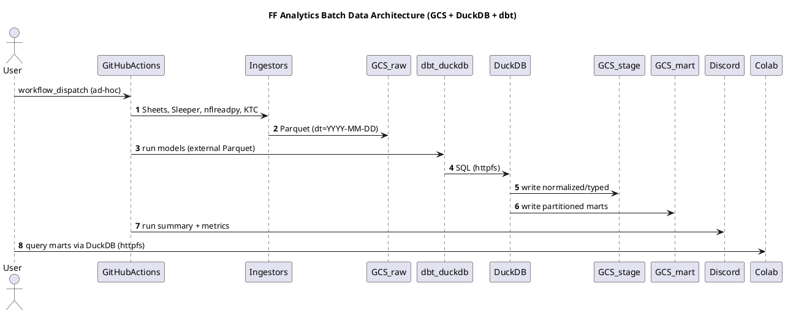

# SPEC‑1 — Fantasy Football Analytics Data Architecture (Consolidated v2)

## Background
A consolidated, dynasty‑format fantasy analytics platform that unifies commissioner‑managed league data, public NFL statistics, and market signals (e.g., KTC players and rookie picks) into a reproducible, auditable, cloud‑first analytics stack. The system favors simple batch updates, preservation of raw data, schema‑on‑read flexibility, and a cost‑efficient footprint. Normal operations run on a twice‑daily automated schedule with secure ad‑hoc remote triggers. Primary consumers are hosted notebooks (Google Colab), with flexibility to add a lightweight UI later without re‑architecting.

---

## Requirements (MoSCoW)
**Must**
- Twice‑daily schedule at **08:00** and **16:00 UTC** (plus manual `workflow_dispatch`). Store all timestamps in **UTC**; notebooks display ET.
- Remote analytics via hosted notebooks (Colab).
- Ingest & persist sources: commissioner **Google Sheet** (authoritative), **nflreadpy/nflverse**, **Sleeper**, **KTC** (Dynasty **1QB default**), injuries/depth charts.
- Preserve **raw immutable snapshots** with history for backfills/time‑travel.
- Canonical entity resolution for **Player/Team/Franchise** across providers; idempotent, retryable jobs; simple **Discord** notifications.
- Reproducible transformations (versioned code + pinned deps) with tests; portability (local ↔ cloud).

**Should**
- Trade valuation marts (players + rookie picks).
- Incremental loads/backfills; data quality reports; partitioning & lifecycle retention; SCD snapshots for rosters/contracts; simple exports; cost/usage observability.

**Could**
- Mobile‑friendly triggers & read‑only views.
- ML‑readiness (feature marts + registry hooks) with no heavy pipeline yet.
- Discord bot for triggers/summaries.

**Won’t (MVP)**
- Real‑time/streaming game‑time mode; heavy microservices/enterprise warehouse features.

---

## Method
### Architecture (Batch, Cloud‑first, Greenfield)
- **Orchestration:** GitHub Actions (`schedule` + `workflow_dispatch`).
- **Compute:** Ephemeral GitHub runners (Python/SQL).
- **Storage:** **Google Cloud Storage (GCS)** — lake‑style layout in **Parquet**.
- **Engine:** **DuckDB** with `httpfs` to read/write `gs://…` directly.
- **Transforms:** **dbt‑duckdb** (models = SQL files, tests, docs, lineage). **External Parquet** tables for marts by default.
- **Analytics:** Google Colab notebooks querying Parquet via DuckDB.
- **Notifications:** Discord webhook (run status + key metrics).

### Storage Layout
```
gs://ff-analytics/
  raw/    # dt=YYYY-MM-DD (ingest date)
  stage/  # mirrors source grain (e.g., season/week)
  mart/   # analytics-ready facts/dims; partitioned by season/week or asof_date
  ops/    # run ledger, model metrics, data quality
```

### dbt‑duckdb — External Parquet Write Strategy
- **Default:** All large or append‑heavy marts are **external Parquet tables** in GCS (no persistent `.duckdb` files in CI).
- **Partitioning:**
  - Weekly/game facts → `['season','week']`
  - Daily market tables → `['asof_date']`
  - Small dimensions → unpartitioned (single Parquet per refresh)
- **Compaction:** Monthly coalescing job targeting **128–256 MB** Parquet row groups per partition to minimize GCS request overhead.
- **Project vars:** `vars: { external_root: "gs://ff-analytics/mart" }`
- **Model defaults:** `+materialized: table`, `+external: true` with the partition keys above.

### Identity & Conformance
- `dim_player_id_xref` (provider IDs → canonical `player_id`).
- `dim_name_alias(player_id, alias, source, first_seen_at)` for fuzzy/alternate names.
- Separate NFL `team_id` vs league `franchise_id` (seasonal mapping).

### 2×2 Stat Model (Actual vs Projected × Real‑world vs Fantasy)
- **Canonical long store:**
  `fact_player_stats(player_id, season, week, game_id, asof_date, measure_domain, stat_kind, horizon, provider, stat_name, stat_value, sample_size, model_version, provider_stat_name?, stat_unit?, src_hash)`
- **Scoring as data:** `dim_scoring_rule` (**SCD2**) seeds league rules (Half‑PPR) and enables recomputation.
- **Friendly marts/views per quadrant:**
  - `mart_real_world_actuals_weekly`, `mart_real_world_projections`
  - `mart_fantasy_actuals_weekly`, `mart_fantasy_projections`

### Trade Valuation (Players + Draft Picks)
- **Assets lens** alongside player‑centric facts.
  - `dim_pick(season, round, overall|slot, round_type)`
  - `dim_asset(asset_type: player|pick, player_id?, pick_id?, display_name)`
  - `fact_asset_market_values(asof_date, asset_id, provider, market_scope='dynasty_1qb', horizon, stat_name in {trade_value_1qb, trade_rank_1qb, …}, stat_value)`
- **Marts/Views:**
  - `mart_market_metrics_daily` (players; 1QB default)
  - `mart_pick_market_daily` (rookie picks; 1QB default)
  - `vw_trade_value_default` (players+picks union; 1QB fields by default)

### Data Quality, Lineage, Metadata (ops schema)
- `ops.run_ledger(run_id, started_at, ended_at, status, trigger, scope, error_class, retry_count)`
- `ops.model_metrics(run_id, model_name, row_count, bytes_written, duration_ms, error_rows?)`
- `ops.data_quality(run_id, model_name, check_name, status, observed_value, threshold)`
- **Freshness UX:** notebooks banner per source (e.g., `sheets_stale`, `market_stale`).

### Failure Handling & Last‑Known‑Good (LKG)
- Global retries with exponential backoff (1m → 2m → 5m; 3 attempts).
- Circuit‑breaker → mark `partial_success`; continue unaffected downstream models.
- LKG fallback for each raw source; marts expose freshness flags.
- **Per‑source policy examples:**
  - Google Sheets: on API failure use previous day’s raw partition; tag `sheets_stale=true`.
  - Sleeper/KTC: throttle; on 429/5xx use LKG for market/league state (2‑day window typical).
  - nflreadpy: if weekly pulls fail, retain last good week partition.

### Schema Evolution & Versioning
- Contracts via dbt `schema.yml`; **additive‑first** changes are non‑breaking.
- Breaking changes → versioned paths (e.g., `mart/fact_weekly_stats_v2/`) + compatibility view.
- Create ADR notes for breaking changes; deprecate old views after one season.

### Security & IAM (MVP hygiene)
- Separate service accounts / IAM roles for `raw`, `mart`, `ops` buckets.
- Rotate Discord webhook quarterly; keep Colab secrets in notebook metadata/secret storage; avoid long‑lived tokens in notebooks.

### Seeds & League Rules
- Seed `dim_scoring_rule` and policy lookups from league rules constants (e.g., scoring, roster limits, contracts/proration, tag logic). Keep seeds versioned and reference them in downstream marts.

---

## Provider Ingestion Notes (Selected)
### KTC (Dynasty 1QB + Picks)
- Parse players and picks separately; normalize to **long** rows with `asset_type in ('player','pick')` and `market_scope='dynasty_1qb'`.
- Picks: derive `(season, round, overall?, round_slot, round_type)`.
- Upsert `dim_pick`, ensure `dim_asset` rows, then write `fact_asset_market_values`.

### Identity Resolution & Aliases (Staging guards)
- Enforce uniqueness on `(provider, provider_id)` or `(provider, normalized_name, team, position)` before mapping to canonical IDs.

---

## Data Lifecycle & Cost Controls
- **GCS Lifecycle**
  - `raw/`: move to **Nearline** after 30 days; optional retention lock to avoid accidental deletes.
  - `mart/`: keep **Standard** (interactive reads); compact monthly.
  - Historical seasons (≥180 days): transition to **Coldline**.
- **Compaction Playbook**
  1) Read partition with projection pushdown; 2) Write to temp with `row_group_size≈256MB`; 3) Atomic swap and cleanup.

---

## Data Quality & Freshness Gates (dbt)
- `accepted_values` on `measure_domain`, `stat_kind`, `horizon`, `market_scope`.
- `fresher_than` macros: e.g., KTC `asof_date >= today-2`; Sheets `dt >= today-2`.
- Row‑delta tests (± thresholds) on `fact_player_stats`, `mart_*_weekly`.

---

## Backfill & Historical Loads
- Ingest historical seasons in batches (e.g., `--season 2012..2024`).
- Build dbt models season‑by‑season to limit working set.
- Compact and transition old seasons to Coldline.

---

## Notebook UX Conventions
- Top‑cell config: `MARKET_SCOPE='dynasty_1qb'`.
- Display freshness banner from `ops` + marts.
- Convenience views: `vw_trade_value_default` selects 1QB columns by default.

---

## Legal & ToS Hygiene
- Scrape politely; cache KTC; avoid redistribution of full vendor tables; respect rate limits for all providers.

---

## ADRs (Examples)
- **ADR‑001** Canonical stat dictionary (neutral names; provider maps).
- **ADR‑002** Twice‑daily cron (08:00, 16:00 UTC).
- **ADR‑003** Versioning strategy for breaking changes (`_vN` + compat views).

---

## Issue Backlog — Starter
1. Buckets & IAM: create `ff-analytics` and service accounts; apply lifecycle policies.
2. Ingestors: implement Sheets, Sleeper, nflreadpy, KTC (players+picks 1QB); retries + LKG.
3. dbt project: external Parquet config; sources; stage models; seeds (Half‑PPR + stat map).
4. Core marts: weekly real‑world & fantasy; asset market marts; default views.
5. Ops: run ledger, model metrics, DQ tests; Discord webhook; health notebook.
6. Compaction: monthly job and metrics; partition audits.
7. Notebooks: roster health, waiver, start/sit, trade scenarios with 1QB default.

---

## (Optional) PlantUML — Component & Flow


---

### Notes on Model Readiness for Future ML (Non‑Blocking)
- Keep canonical long‑form facts and feature‑ready marts (e.g., per‑player per‑week table with neutral stat names and scoring) to allow future integration with a feature registry without changing core schema.

---

### Appendix — dbt Snippets (Reference)
**dbt_project.yml (partial)**
```yaml
name: ff_analytics
version: 1.0
profile: ff_duckdb
config-version: 2
vars:
  external_root: "gs://ff-analytics/mart"
models:
  +materialized: table
  +external: true
  core:
    +partition_by: ['season','week']
  markets:
    +partition_by: ['asof_date']
    +cluster_by: ['asset_id']
```

**profiles.yml (partial)**
```yaml
ff_duckdb:
  target: prod
  outputs:
    prod:
      type: duckdb
      path: ":memory:"
      threads: 4
      extensions: [httpfs]
```
