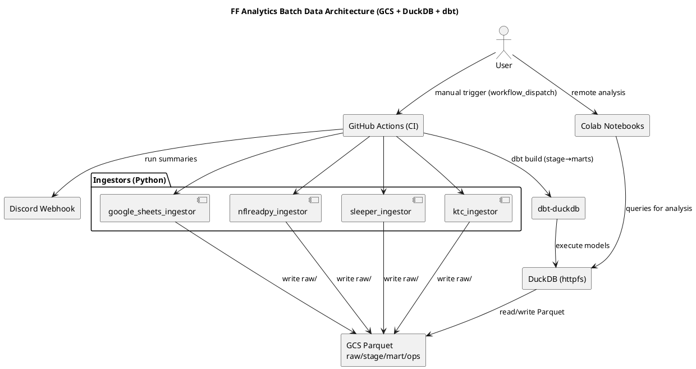

# SPEC-1—Fantasy Football Analytics Data Architecture

## Background

You’re building a dynasty-format fantasy football analytics platform that consolidates commissioner-managed league data, public NFL stats, and market signals into a reproducible, auditable, and remotely accessible analytics stack. The system favors simple batch updates, preservation of raw data, schema-on-read flexibility, and a cost-efficient yet scalable footprint. Normal operations run on a daily automated schedule, with secure ad‑hoc remote triggers available as needed. Primary consumers are hosted notebooks; future UI/dashboards may be layered on top without re-architecting.

---

## Requirements (MoSCoW)

**Must**
- Automated daily batch refresh (≤10–15 min typical) with zero routine manual steps.
- Ad-hoc **remote** trigger (from your computer) of full/partial refresh with lightweight auth.
- Remote analytics via hosted **notebooks** (Google Colab for MVP).
- Ingest & persist: commissioner Google Sheet (authoritative), NFL stats (nflreadpy/nflverse), fantasy platform (Sleeper), market data (KTC), injuries/depth charts.
- Preserve **raw immutable snapshots** with history for backfills/time-travel.
- Canonical entity resolution for **PlayerID/Team/Franchise** across providers.
- Idempotent, retryable jobs; clear lineage/logs; simple **Discord** notifications.
- Reproducible transformations (versioned code + pinned deps) with tests.
- Cost-efficient by default with headroom for justified upgrades.
- Portability: same code paths locally and in cloud.

**Should**
- **Trade valuation marts** for calculators & what-ifs (players + draft picks).
- Incremental loading/backfills; data quality reports; partitioning & retention.
- SCD snapshots for rosters/contracts; simple export surfaces (CSV/Parquet/REST).
- Basic cost/usage observability.

**Could**
- Mobile-friendly trigger & read-only views.
- **ML-readiness**: feature-ready marts & registry hooks (no complex pipeline yet).
- Discord bot for triggers and summaries.

**Won’t (MVP)**
- Real-time/streaming game‑time mode.
- Heavy microservices; enterprise warehouse bells/whistles.

---

## Method

### Architecture (Batch, Cloud-first, Greenfield)
- **Orchestration**: GitHub Actions
  - Triggers: `schedule` (2× daily at 08:00 UTC and 16:00 UTC) + `workflow_dispatch` (manual, scoped runs)
- **Compute**: Ephemeral GitHub runners (Python/SQL)
- **Storage**: **Google Cloud Storage (GCS)** — lake-style layout in **Parquet**
- **Warehouse Engine**: **DuckDB** (file-backed) with `httpfs` to read/write `gs://…`
- **Transform Layer**: **dbt-duckdb** (models = SQL files, tests, docs, lineage)
- **Remote Analytics**: **Google Colab** notebooks querying GCS Parquet via DuckDB
- **Notifications**: **Discord** webhook (run status + key metrics)

### Storage Layout (example)
```
gs://ff-analytics/
  raw/           # immutable, partitioned by dt=YYYY-MM-DD per source
    google_sheets/  nflreadpy/  sleeper/  ktc/  injuries/  depth_charts/
  stage/         # normalized, typed, deduped (near-source grain)
  mart/          # analytics-ready facts/dims (star-ish), SCD dims
  ops/           # run ledger, model metrics, data quality
```

### Identity & Conformance
- `dim_player_id_xref`: maps `(nflreadpy_gsis, sleeper_id, espn_id, ktc_id?, pfr_id, …)` to a **canonical `player_id`**.
- Separate **NFL team** vs **league franchise** keys; seasonal mapping table.

### 2×2 Stat Model (Actual vs Projected × Real-world vs Fantasy)
- Canonical long-form store: `fact_player_stats`
  - Axes: `measure_domain` = `real_world|fantasy`, `stat_kind` = `actual|projected`, `horizon` = `game|week|ros|season`, `provider`, `stat_name`, `stat_value`, `asof_date`
  - Neutral **canonical stat dictionary** (snake_case) — not provider-specific
- Friendly marts/views per quadrant:
  - `mart_real_world_actuals_weekly`, `mart_real_world_projections`
  - `mart_fantasy_actuals_weekly`, `mart_fantasy_projections`
- `dim_scoring_rule` (SCD2): seeds league rules; derive fantasy from real-world

### Trade Valuation Model (Players + Draft Picks)
- **Assets lens** alongside player-centric facts
  - `dim_pick` (season, round, overall|slot)
  - `dim_asset` (`asset_type: player|pick`, link to `player_id` or `pick_id`)
  - `fact_asset_market_values` (daily KTC values/ranks across 1QB/SF/Redraft)
- Marts:
  - `mart_market_metrics_daily` (players; 1QB default)
  - `mart_pick_market_daily` (rookie picks; 1QB default)
  - `vw_trade_value_default` (players+picks union, 1QB fields by default)

### Data Quality, Lineage, Metadata
- dbt tests: `not_null`, `unique`, `accepted_values`, source **freshness** SLAs
- **ops** schema in Parquet:
  - `ops.run_ledger(run_id, started_at, ended_at, status, trigger, scope, error_class, retry_count)`
  - `ops.model_metrics(run_id, model_name, row_count, bytes_written, duration_ms)`
  - `ops.data_quality(run_id, model_name, check_name, status, observed_value, threshold)`
- Discord posts summarized status + counts per run

### Failure Handling & Graceful Degradation
- Global retries with exponential backoff (e.g., 1m → 2m → 5m; 3 attempts)
- Circuit-breaker → mark `partial_success`; continue unaffected downstream models
- **Last-known-good (LKG)** fallback for each raw source; marts expose freshness flags
- Per-source policy examples:
  - **Google Sheets**: on API failure use previous day’s raw partition; tag `sheets_stale=true`
  - **Sleeper/KTC**: throttle; on 429/5xx, use LKG for market/league state
  - **nflreadpy**: if weekly pulls fail, retain last good week partition

### Schema Evolution & Versioning
- Contracts via dbt `schema.yml`; **additive-first** changes are non-breaking
- Breaking changes → versioned paths (e.g., `mart/fact_weekly_stats_v2/`) + compatibility view
- ADR note per breaking change; deprecate old view after a season window

### PlantUML — Component & Flow


### Core Schemas (selected)
```sql
-- Canonical player IDs (xref)
CREATE TABLE dim_player_id_xref (
  player_id TEXT,
  gsis_id TEXT, sleeper_id TEXT, espn_id TEXT, ktc_id TEXT, pfr_id TEXT,
  nfl_id TEXT, yahoo_id TEXT, cbs_id TEXT,
  PRIMARY KEY (player_id)
);

-- Conformed player dimension (SCD2)
CREATE TABLE dim_player (
  player_sk BIGINT,
  player_id TEXT,
  full_name TEXT, position TEXT, team_id TEXT,
  height_in INT, weight_lb INT, birth_date DATE, age DOUBLE,
  valid_from DATE, valid_to DATE, is_current BOOLEAN,
  src_hash TEXT
);

-- Scoring rules (SCD2)
CREATE TABLE dim_scoring_rule (
  scoring_id TEXT,
  stat_name TEXT,            -- e.g., receptions, rushing_yards
  multiplier DOUBLE,
  applies_to TEXT,           -- position group or 'ALL'
  valid_from DATE, valid_to DATE, is_current BOOLEAN
);

-- Fact: unified long-form stats (supports 2×2 matrix)
CREATE TABLE fact_player_stats (
  player_id TEXT,
  season INT, week INT, game_id TEXT, asof_date DATE,
  measure_domain TEXT,    -- real_world | fantasy
  stat_kind TEXT,         -- actual | projected
  horizon TEXT,           -- game|week|ros|season
  provider TEXT,
  stat_name TEXT,
  stat_value DOUBLE,
  sample_size DOUBLE,
  model_version TEXT,
  src_hash TEXT
);

-- Assets for market values (players and picks)
CREATE TABLE dim_pick (
  pick_id TEXT PRIMARY KEY,
  season INT, round INT, overall INT,
  round_slot TEXT, notes TEXT
);

CREATE TABLE dim_asset (
  asset_id TEXT PRIMARY KEY,
  asset_type TEXT CHECK (asset_type in ('player','pick')),
  player_id TEXT, pick_id TEXT,
  display_name TEXT,
  is_active BOOLEAN,
  valid_from DATE, valid_to DATE, is_current BOOLEAN
);

CREATE TABLE fact_asset_market_values (
  asof_date DATE,
  asset_id TEXT,
  provider TEXT,              -- 'ktc'
  horizon TEXT,               -- 'season'
  stat_name TEXT,             -- trade_value_1qb, trade_rank_1qb, ...
  stat_value DOUBLE,
  model_version TEXT,
  src_hash TEXT
);
```

---

## Implementation

### Repos, Environments, Buckets
```
/ingest/                  # python source connectors
  sheets.py sleeper.py nflreadpy.py ktc.py
/dbt/                     # dbt-duckdb project
  dbt_project.yml
  profiles.yml            # templated; CI fills env vars
  models/
    sources.yml
    stage/*.sql
    marts/core/*.sql
    marts/trade/*.sql
  seeds/
    dim_scoring_rule.csv
    dim_stat_map.csv
    ktc_pick_aliases.csv  # optional
/tests/                   # generic & bespoke tests
/ops/                     # health notebooks + helper scripts
.github/workflows/pipeline.yml
requirements.txt
```
- **Storage**: `gs://ff-analytics/` with `raw/`, `stage/`, `mart/`, `ops/`
- **Colab**: notebooks query `gs://` directly via DuckDB `httpfs`

### Secrets & Auth (GitHub → env → DuckDB/dbt)
- GitHub Secrets: `GCS_KEY_ID`, `GCS_KEY_SECRET`, `GOOGLE_SA_JSON` (base64), `DISCORD_WEBHOOK`
- Export SA to file at runtime; create DuckDB GCS secret via env (no hardcoding)

### Ingestion (Python — highlights)
- **Google Sheets** → Parquet (`raw/google_sheets/dt=…/…`); LKG on failure
- **Sleeper** → league/roster/transactions; rate-limit aware; raw snapshots
- **nflreadpy** → weekly, pbp, participation, snaps, nextgen, rankings; raw & partitioned
- **KTC (Dynasty 1QB; players + picks)**
  - Normalize to **long** shape with `entity_type`, `display_name`, `season/round/overall/round_slot`, `stat_name` (`trade_value_1qb`, `trade_rank_1qb`, optional SF/Redraft), `stat_value`, `asof_date`, `provider='ktc'`
  - Upsert `dim_pick`, ensure `dim_asset` rows for players and picks
  - Write `fact_asset_market_values` rows

### dbt-duckdb (profiles & sources — excerpts)
```yaml
# profiles.yml
ff_duckdb:
  target: prod
  outputs:
    prod:
      type: duckdb
      path: ":memory:"
      threads: 4
      extensions: [httpfs]
```
```yaml
# models/sources.yml
version: 2
sources:
  - name: raw
    tables:
      - name: ktc_market
        external:
          location: "gs://ff-analytics/raw/ktc/dt=*/ktc-values.parquet"
          using: parquet
      - name: nfl_weekly
        external:
          location: "gs://ff-analytics/raw/nflreadpy/weekly/season=*/week=*/part-*.parquet"
          using: parquet
      - name: google_sheets_rosters
        external:
          location: "gs://ff-analytics/raw/google_sheets/dt=*/rosters-*.parquet"
          using: parquet
```

### Seeds (initial)
- `dim_scoring_rule.csv`: preset `HALF_PPR_SLEExt_2025` with offensive/K/DEF/IDP weights (half‑PPR)
- `dim_stat_map.csv`: provider→canonical mappings for Sleeper & nflreadpy (plus KTC player fields)
- `ktc_pick_aliases.csv` (optional): normalize pick strings → `(season, round, overall|slot)`

### Orchestration (GitHub Actions — excerpt)
```yaml
name: ff-data-pipeline
on:
  schedule:
    - cron: "0 8 * * *"   # 08:00 UTC
    - cron: "0 16 * * *"  # 16:00 UTC
  workflow_dispatch:
    inputs:
      scope: {type: choice, options: [all,sheets,nfl,sleeper,ktc], default: all}
      start_date: {required: false}
      end_date:   {required: false}

jobs:
  run:
    runs-on: ubuntu-latest
    env:
      GCS_KEY_ID: ${{ secrets.GCS_KEY_ID }}
      GCS_KEY_SECRET: ${{ secrets.GCS_KEY_SECRET }}
      GOOGLE_SA_JSON: ${{ secrets.GOOGLE_SA_JSON }}
      DISCORD_WEBHOOK: ${{ secrets.DISCORD_WEBHOOK }}
    steps:
      - uses: actions/checkout@v4
      - uses: actions/setup-python@v5
        with: {python-version: "3.11"}
      - name: Install deps
        run: pip install -r requirements.txt
      - name: Decrypt SA & configure DuckDB GCS
        run: |
          echo "$GOOGLE_SA_JSON" | base64 -d > $RUNNER_TEMP/sa.json
          echo "GOOGLE_APPLICATION_CREDENTIALS=$RUNNER_TEMP/sa.json" >> $GITHUB_ENV
      - name: Ingest
        run: python ingest/runner.py --scope "${{ inputs.scope || 'all' }}" --start "${{ inputs.start_date }}" --end "${{ inputs.end_date }}"
      - name: dbt build
        run: |
          dbt deps --project-dir dbt
          dbt build --project-dir dbt --fail-fast
      - name: Post-run metrics & Discord
        run: python ops/post_run.py
```

### Failure Handling & LKG (implementation)
- Retries: 3 attempts @ 60s/120s/300s
- On persistent failure: write `run_ledger.status='partial_success'`, keep last good partition, expose `*_stale` flags in marts

### Schema Evolution (implementation)
- Additive columns allowed by default
- Breaking changes → new `_vN` path + compatibility view + ADR + season-long deprecation

---

## Milestones

**M1 – Ingest & Raw Lake**
- Sheets, Sleeper, nflreadpy (weekly/pbp/core), KTC (Dynasty 1QB: players + picks) → `raw/`
- LKG + retries + run ledger

**M2 – dbt Stage & Core Marts**
- Stage models normalize to canonical stats; `dim_player_id_xref`, `dim_player`, scoring seeds
- Core marts: `dim_player (SCD2)`, `fact_player_stats`, weekly real-world & fantasy marts

**M3 – Trade Valuation (Should)**
- `dim_pick`, `dim_asset`, `fact_asset_market_values`
- `mart_market_metrics_daily` (players), `mart_pick_market_daily` (picks), `vw_trade_value_default`

**M4 – Ops & Observability**
- `ops.*` tables populated per run; Discord summaries; weekly health notebook

**M5 – Colab Analytics Pack**
- Notebooks: roster health, waiver targets, start/sit baselines, trade scenarios (players+picks, 1QB default)

