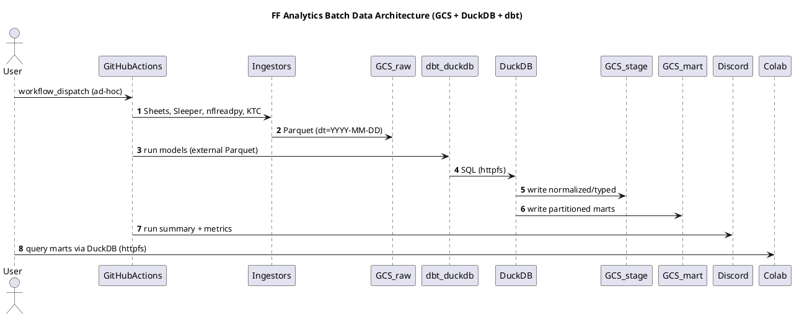

# SPEC‑1 — Fantasy Football Analytics Data Architecture (Consolidated v2)

<!--toc:start-->

- [SPEC‑1 — Fantasy Football Analytics Data Architecture (Consolidated v2)](#spec1--fantasy-football-analytics-data-architecture-consolidated-v2)
  - [Background](#background)
  - [Requirements (MoSCoW)](#requirements-moscow)
  - [Method](#method)
    - [Architecture (Batch, Cloud‑first, Greenfield)](#architecture-batch-cloudfirst-greenfield)
    - [Storage Layout](#storage-layout)
    - [dbt‑duckdb — External Parquet Write Strategy](#dbtduckdb--external-parquet-write-strategy)
    - [Identity & Conformance](#identity--conformance)
    - [2×2 Stat Model (Actual vs Projected × Real‑world vs Fantasy)](#22-stat-model-actual-vs-projected--realworld-vs-fantasy)
    - [Trade Valuation (Players + Draft Picks)](#trade-valuation-players--draft-picks)
    - [Data Quality, Lineage, Metadata (ops schema)](#data-quality-lineage-metadata-ops-schema)
    - [Failure Handling & Last‑Known‑Good (LKG)](#failure-handling--lastknowngood-lkg)
    - [Schema Evolution & Versioning](#schema-evolution--versioning)
    - [Security & IAM (MVP hygiene)](#security--iam-mvp-hygiene)
    - [Seeds & League Rules](#seeds--league-rules)
  - [Provider Ingestion Notes (Selected)](#provider-ingestion-notes-selected)
    - [KTC (Dynasty 1QB + Picks)](#ktc-dynasty-1qb--picks)
    - [Identity Resolution & Aliases (Staging guards)](#identity-resolution--aliases-staging-guards)
  - [Data Lifecycle & Cost Controls](#data-lifecycle--cost-controls)
  - [Data Quality & Freshness Gates (dbt)](#data-quality--freshness-gates-dbt)
  - [Backfill & Historical Loads](#backfill--historical-loads)
  - [Notebook UX Conventions](#notebook-ux-conventions)
  - [Legal & ToS Hygiene](#legal--tos-hygiene)
  - [Architecture Decision Records](#architecture-decision-records)
  - [Issue Backlog — Starter](#issue-backlog--starter)
  - [(Optional) PlantUML — Component & Flow](#optional-plantuml--component--flow)
  - [Notes on Model Readiness for Future ML (Non‑Blocking)](#notes-on-model-readiness-for-future-ml-nonblocking)
  - [Appendix — dbt Snippets (Reference)](#appendix--dbt-snippets-reference)
  <!--toc:end-->

## Background

A consolidated, dynasty‑format fantasy analytics platform that unifies
commissioner‑managed league data, public NFL statistics, and market signals
(e.g., KTC players and rookie picks) into a reproducible, auditable,
cloud‑first analytics stack. The system favors simple batch updates, preservation
of raw data, schema‑on‑read flexibility, and a cost‑efficient footprint. Normal
operations run on a twice‑daily automated schedule with secure ad‑hoc remote
triggers. Primary consumers are hosted notebooks (Google Colab), with flexibility
to add a lightweight UI later without re‑architecting.

______________________________________________________________________

## Requirements (MoSCoW)

### Must

- Twice‑daily schedule at **08:00** and **16:00 UTC** (plus manual
  `workflow_dispatch`). Store all timestamps in **UTC**; notebooks display ET.
- Remote analytics via hosted notebooks (Colab).
- Ingest & persist sources: commissioner **Google Sheet** (authoritative),
  **nflreadpy/nflverse**, **Sleeper**, **KTC** (Dynasty **1QB default**),
  injuries/depth charts.
- Preserve **raw immutable snapshots** with history for backfills/time‑travel.
- Canonical entity resolution for **Player/Team/Franchise** across providers;
  idempotent, retryable jobs; simple **Discord** notifications.
- Reproducible transformations (versioned code + pinned deps) with tests;
  portability (local ↔ cloud).

### Should

- Trade valuation marts (players + rookie picks).
- Incremental loads/backfills; data quality reports; partitioning & lifecycle
  retention; SCD snapshots for rosters/contracts; simple exports; cost/usage
  observability.

### Could

- Mobile‑friendly triggers & read‑only views.
- ML‑readiness (feature marts + registry hooks) with no heavy pipeline yet.
- Discord bot for triggers/summaries.

### Won't (MVP)

- Real‑time/streaming game‑time mode; heavy microservices/enterprise warehouse features.

______________________________________________________________________

## Method

### Architecture (Batch, Cloud‑first, Greenfield)

- **Orchestration:** GitHub Actions (`schedule` + `workflow_dispatch`).
- **Compute:** Ephemeral GitHub runners (Python/SQL).
- **Storage:** **Google Cloud Storage (GCS)** — lake‑style layout in **Parquet**.
- **Engine:** **DuckDB** with `httpfs` to read/write `gs://…` directly.
- **Transforms:** **dbt‑duckdb** (models = SQL files, tests, docs, lineage).
  **External Parquet** tables for marts by default.
- **Analytics:** Google Colab notebooks querying Parquet via DuckDB.
- **Notifications:** Discord webhook (run status + key metrics).

### Storage Layout

```text
gs://ff-analytics/
  raw/    # dt=YYYY-MM-DD (ingest date)
  stage/  # mirrors source grain (e.g., season/week)
  mart/   # analytics-ready facts/dims; partitioned by season/week or asof_date
  ops/    # run ledger, model metrics, data quality
```

### dbt‑duckdb — External Parquet Write Strategy

- **Default:** All large or append‑heavy marts are **external Parquet tables**
  in GCS (no persistent `.duckdb` files in CI).
- **Partitioning:**
  - Weekly/game facts → `['season','week']`
  - Daily market tables → `['asof_date']`
  - Small dimensions → unpartitioned (single Parquet per refresh)
- **Compaction:** Monthly coalescing job targeting **128–256 MB** Parquet row
  groups per partition to minimize GCS request overhead.
- **Project vars:** `vars: { external_root: "gs://ff-analytics/mart" }`
- **Model defaults:** `+materialized: table`, `+external: true` with the
  partition keys above.

### Identity & Conformance

- `dim_player_id_xref` (provider IDs → canonical `player_id`).
- `dim_name_alias(player_id, alias, source, first_seen_at)` for fuzzy/alternate names.
- Separate NFL `team_id` vs league `franchise_id` (seasonal mapping).

**Dimensional Modeling Guidance:** For detailed patterns on implementing
conformed dimensions, surrogate keys, SCDs, and fact table design, see
`docs/architecture/kimball_modeling_guidance/kimbal_modeling.md`.

### 2×2 Stat Model (Actual vs Projected × Real‑world vs Fantasy)

- **Canonical long store:**
  `fact_player_stats(player_id, season, week, game_id, asof_date, measure_domain, stat_kind, horizon, provider, stat_name, stat_value, sample_size, model_version, provider_stat_name?, stat_unit?, src_hash)`
- **Scoring as data:** `dim_scoring_rule` (**SCD2**) seeds league rules
  (Half‑PPR) and enables recomputation.
- **Friendly marts/views per quadrant:**
  - `mart_real_world_actuals_weekly`, `mart_real_world_projections`
  - `mart_fantasy_actuals_weekly`, `mart_fantasy_projections`

### Trade Valuation (Players + Draft Picks)

- **Assets lens** alongside player‑centric facts.
  - `dim_pick(season, round, overall|slot, round_type)`
  - `dim_asset(asset_type: player|pick, player_id?, pick_id?, display_name)`
  - `fact_asset_market_values(asof_date, asset_id, provider, market_scope='dynasty_1qb', horizon, stat_name in {trade_value_1qb, trade_rank_1qb, …}, stat_value)`
- **Marts/Views:**
  - `mart_market_metrics_daily` (players; 1QB default)
  - `mart_pick_market_daily` (rookie picks; 1QB default)
  - `vw_trade_value_default` (players+picks union; 1QB fields by default)

### Data Quality, Lineage, Metadata (ops schema)

- \`ops.run_ledger(run_id, started_at, ended_at, status, trigger, scope,
  error_class, retry_count)
- `ops.model_metrics(run_id, model_name, row_count, bytes_written, duration_ms, error_rows?)`
- `ops.data_quality(run_id, model_name, check_name, status, observed_value, threshold)`
- **Freshness UX:** notebooks banner per source (e.g., `sheets_stale`, `market_stale`).

### Failure Handling & Last‑Known‑Good (LKG)

- Global retries with exponential backoff (1m → 2m → 5m; 3 attempts).
- Circuit‑breaker → mark `partial_success`; continue unaffected downstream models.
- LKG fallback for each raw source; marts expose freshness flags.
- **Per‑source policy examples:**
  - Google Sheets: on API failure use previous day’s raw partition; tag `sheets_stale=true`.
  - Sleeper/KTC: throttle; on 429/5xx use LKG for market/league state
    (2‑day window typical).
  - nflreadpy: if weekly pulls fail, retain last good week partition.

### Schema Evolution & Versioning

- Contracts via dbt `schema.yml`; **additive‑first** changes are non‑breaking.
- Breaking changes → versioned paths (e.g., `mart/fact_weekly_stats_v2/`) +
  compatibility view.
- Create ADR notes for breaking changes; deprecate old views after one season.

### Security & IAM (MVP hygiene)

- Separate service accounts / IAM roles for `raw`, `mart`, `ops` buckets.
- Rotate Discord webhook quarterly; keep Colab secrets in notebook
  metadata/secret storage; avoid long‑lived tokens in notebooks.

### Seeds & League Rules

- Seed `dim_scoring_rule` and policy lookups from league rules constants
  (e.g., scoring, roster limits, contracts/proration, tag logic). Keep seeds
  versioned and reference them in downstream marts.

______________________________________________________________________

## Provider Ingestion Notes (Selected)

### Commissioner Google Sheet (Complex Source)

- **Challenge**: Direct API reads timeout due to sheet complexity (formulas,
  external connections)
- **Solution**: Server-side copy strategy (see ADR-005)
  - Use `copyTo()` API to duplicate tabs without reading values
  - Freeze formulas to values via batch operations
  - Atomic rename/swap for consistency
  - Log to Shared Drive (avoids service account 0GB quota issue)
- **Skip Logic**: Check source `modifiedTime` to avoid unnecessary copies
- **Output**: Simple values-only sheet that downstream pipeline can read reliably

### KTC (Dynasty 1QB + Picks)

- Parse players and picks separately; normalize to **long** rows with
  `asset_type in ('player','pick')` and `market_scope='dynasty_1qb'`.
- Picks: derive `(season, round, overall?, round_slot, round_type)`.
- Upsert `dim_pick`, ensure `dim_asset` rows, then write `fact_asset_market_values`.

### Identity Resolution & Aliases (Staging guards)

- Enforce uniqueness on `(provider, provider_id)` or `(provider, normalized_name, team, position)` before mapping to canonical IDs.

______________________________________________________________________

## Data Lifecycle & Cost Controls

- **GCS Lifecycle**
  - `raw/`: move to **Nearline** after 30 days; optional retention lock to
    avoid accidental deletes.
  - `mart/`: keep **Standard** (interactive reads); compact monthly.
  - Historical seasons (≥180 days): transition to **Coldline**.
- **Compaction Playbook**
  1. Read partition with projection pushdown; 2) Write to temp with
     `row_group_size≈256MB`; 3) Atomic swap and cleanup.

______________________________________________________________________

## Data Quality & Freshness Gates (dbt)

- `accepted_values` on `measure_domain`, `stat_kind`, `horizon`, `market_scope`.
- `fresher_than` macros: e.g., KTC `asof_date >= today-2`; Sheets `dt >= today-2`.
- Row‑delta tests (± thresholds) on `fact_player_stats`, `mart_*_weekly`.

______________________________________________________________________

## Backfill & Historical Loads

- Ingest historical seasons in batches (e.g., `--season 2012..2024`).
- Build dbt models season‑by‑season to limit working set.
- Compact and transition old seasons to Coldline.

______________________________________________________________________

## Notebook UX Conventions

- Top‑cell config: `MARKET_SCOPE='dynasty_1qb'`.
- Display freshness banner from `ops` + marts.
- Convenience views: `vw_trade_value_default` selects 1QB columns by default.

______________________________________________________________________

## Legal & ToS Hygiene

- Scrape politely; cache KTC; avoid redistribution of full vendor tables;
  respect rate limits for all providers.

______________________________________________________________________

## Architecture Decision Records

- **ADR‑001** Canonical stat dictionary (neutral names; provider maps).
- **ADR‑002** Twice‑daily cron (08:00, 16:00 UTC).
- **ADR‑003** Versioning strategy for breaking changes (`_vN` + compat views).
- **ADR‑004** GitHub Actions for Sheets access (CI/CD authentication).
  [`docs/adr/ADR-004-github-actions-for-sheets.md`](../adr/ADR-004-github-actions-for-sheets.md)
- **ADR‑005** Commissioner Sheet ingestion via server-side copy strategy
  (handles complex sheets).
  [`docs/adr/ADR-005-commissioner-sheet-ingestion-strategy.md`](../adr/ADR-005-commissioner-sheet-ingestion-strategy.md)
- **ADR‑006** GCS integration strategy (environment-based configuration for
  local vs cloud storage).
  [`docs/adr/ADR-006-gcs-integration-strategy.md`](../adr/ADR-006-gcs-integration-strategy.md)
- **ADR‑007** Separate fact tables for actuals vs projections (2×2 model implementation).
  [`docs/adr/ADR-007-separate-fact-tables-actuals-vs-projections.md`](../adr/ADR-007-separate-fact-tables-actuals-vs-projections.md)
- **ADR‑008** League transaction history integration (TRANSACTIONS tab).
  [`docs/adr/ADR-008-league-transaction-history-integration.md`](../adr/ADR-008-league-transaction-history-integration.md)

______________________________________________________________________

## Issue Backlog — Starter

**Implementation Progress (as of 2025-10-24):**

See `SPEC-1_v_2.3_implementation_checklist_v_0.md` for detailed status. Summary:

- ✅ Phase 1 (Seeds) complete
- ✅ Phase 2A (NFL Actuals) 95% complete
- ⚠️ Phase 2B (League Data) 80% complete
- ⏳ Phase 2C/D (Market, Projections) in progress
- ⏳ Phase 3 (Ops, Compaction, Notebooks) pending

**Original backlog:**

1. Buckets & IAM: create `ff-analytics` and service accounts; apply lifecycle
   policies.
1. Ingestors: implement Sheets, Sleeper, nflreadpy, KTC (players+picks 1QB);
   retries + LKG.
1. dbt project: external Parquet config; sources; stage models; seeds
   (Half‑PPR + stat map).
1. Core marts: weekly real‑world & fantasy; asset market marts; default views.
1. Ops: run ledger, model metrics, DQ tests; Discord webhook; health notebook.
1. Compaction: monthly job and metrics; partition audits.
1. Notebooks: roster health, waiver, start/sit, trade scenarios with 1QB
   default.

______________________________________________________________________

## (Optional) PlantUML — Component & Flow



______________________________________________________________________

### Notes on Model Readiness for Future ML (Non‑Blocking)

- Keep canonical long‑form facts and feature‑ready marts (e.g., per‑player
  per‑week table with neutral stat names and scoring) to allow future
  integration with a feature registry without changing core schema.

______________________________________________________________________

### Appendix — dbt Snippets (Reference)

### dbt_project.yml (partial)

```yaml
name: ff_analytics
version: 1.0
profile: ff_duckdb
config-version: 2
vars:
  external_root: "gs://ff-analytics/mart"
models:
  +materialized: table
  +external: true
  core:
    +partition_by: ["season", "week"]
  markets:
    +partition_by: ["asof_date"]
    +cluster_by: ["asset_id"]
```

### profiles.yml (partial)

```yaml
ff_duckdb:
  target: prod
  outputs:
    prod:
      type: duckdb
      path: ":memory:"
      threads: 4
      extensions: [httpfs]
```

______________________________________________________________________

## Addendum — SPEC v2.2 (Consolidated)

*(generated 2025-09-24T23:36:28.569837Z)*

The following sections supersede or augment parts of v2:

## SPEC-1 Consolidated (v2 → v2.2 patch)

Generated: 2025-09-24T23:30:42.789792Z

## Orchestration & Language Strategy (CONFIRMED + SHIM DETAILS)

**Primary orchestrator:** Python (uv-managed).

### Loaders

- **nflverse:** Python-first via `nflreadpy`, with a **Python shim** that
  falls back to `nflreadr` (R) when a dataset/utility is unavailable in Python
  or misbehaves.
- **FFanalytics (projections):** R-native runner (invoked from Python); not
  part of the nflverse shim.

### nflverse Shim (NEW)

A unified Python entrypoint that:

1. Tries `nflreadpy` for the requested dataset(s).
1. On `NotImplementedError`, `AttributeError`, or explicit "no coverage" in the
   registry, calls an R script (`Rscript scripts/nflverse_load.R ...`) that
   uses `nflreadr`.
1. Writes partitioned Parquet with a standard metadata footer and returns the
   output manifest.

**Function signature (conceptual):**

```python
load_nflverse(dataset: str,
              seasons: list[int] | int | None = None,
              weeks: list[int] | int | None = None,
              out_dir: str = "gs://ff-analytics/raw/nflverse",
              loader_preference: str = "python_first", # or "r_only" / "python_only"
              extra_args: dict | None = None) -> dict
```

**Behavior:**

- **Registry-driven** mapping from logical dataset names to concrete loader
  calls.
- **Tracing/logging:** log which path ran (`python` vs `r_fallback`), versions
  (`nflreadpy.__version__`, `nflreadr` session), and parameters.
- **Contracts:** always produce the same schema per dataset regardless of
  loader; any loader-specific quirks are normalized in the shim before write.

### Repo layout (relevant parts)

```text
/ingest/nflverse/
  shim.py                 # load_nflverse(...) + registry & fallbacks
  registry.py             # dataset→loader function map, coverage flags
/scripts/R/
  nflverse_load.R         # R entrypoint using nflreadr::load_* then writes Parquet
  ffanalytics_run.R       # R entrypoint for weekly projections
/config/
  renv.lock               # pinned R packages (nflreadr >= 1.5.0, ffanalytics deps)
  uv.lock                 # Python lock incl. nflreadpy, polars, pyarrow
```

**nflverse scheduling:**

- Weekly Monday 08:00 UTC (in-season) + ad-hoc historical.
- Optional overlay to twice-daily cron for injuries/depth charts if desired.

**Version pins (as of today):**

- `nflreadr` **1.5.0** (CRAN)
- `nflreadpy` **0.1.1** (PyPI/GitHub lifecycle: experimental)
- `polars` **>=0.20**; `pyarrow` **>=15**

## FFanalytics Runner (CLARIFIED)

- Invoked by Python (`subprocess`), but **not** behind the nflverse shim.
- Outputs a long-form `fact_player_projections` with consistent schema; stores
  scrape logs and site coverage stats.
- Config via YAML (sites, weights, scoring rules) passed to `ffanalytics_run.R`.

## Storage Path Convention (CONFIRMED)

- Raw: `gs://ff-analytics/raw/<provider>/<dataset>/dt=YYYY-MM-DD/`
- Stage: `gs://ff-analytics/stage/<provider>/<dataset>/`
- Mart: `gs://ff-analytics/mart/<domain>/...`
- Always include `asof_datetime` (UTC), `source_name`, `source_version`, and
  `loader_path`.

## Identity, Change Capture, Freshness (CONFIRMED)

- No change from v2.1 patch; applies equally regardless of loader path.

______________________________________________________________________

## Addendum — v2.2 vs. v2.3 Implementation Reconciliation

This section documents design decisions that evolved during implementation (2025-09-29 through 2025-10-24), captured in:

- SPEC-1 v2.3 Implementation Checklist (execution status)
- Refined Data Model Plan v4.x addenda (v4.1, v4.2, v4.3) (technical specifications)
- Formal ADRs (decision rationale and alternatives)

The refined_data_model_plan_v4.md is the **technical blueprint** for implementing the 2×2 model (separate facts, real-world base layer, mart-level scoring). v2.3 checklist shows **execution progress** against that blueprint.

### Design Evolution Summary

v2.2 was the **initial blueprint**. During implementation, we discovered and documented refinements:

| Original Design (v2.2) | Technical Plan (v4.x) | Implemented in v2.3 | Rationale |
| -------------------------------------------------------------------------------------------- | ------------------------------------------------------------------------------------------------------------------------ | ------------------------ | ----------------------------------------------------------------------------------------------------------------------------------------------------------------------------------------------------------------------------------------------------------------------------------------------------------- |
| **Single `fact_player_stats` table** with `stat_kind` enum (actuals + projections) | **Separate tables** (v4.1): `fact_player_stats` (actuals) + `fact_player_projections` (projections) | ✅ Implemented | Per-game actuals (`game_id` required) vs. weekly/season projections (no `game_id`) have incompatible grains. Separate tables eliminate nullable keys and conditional logic. See ADR-007 and refined_data_model_plan_v4.md § "Addendum: Projections Integration (v4.1)" for full rationale and alternatives. |
| **Fact tables store both `measure_domain='real_world'` AND `measure_domain='fantasy'`** | **Fact tables store `measure_domain='real_world'` only** (v4.1); fantasy scoring applied in marts via `dim_scoring_rule` | ✅ Implemented | Cleaner separation of concerns (Kimball alignment): facts = immutable raw data, marts = scored/transformed layer. Improves change management (scoring rule updates don't touch facts). Enables 2×2 model: both actuals and projections start in real-world layer, scored in marts. |
| **Canonical `fact_player_stats` includes `horizon` column for both actuals and projections** | **`horizon` field only in `fact_player_projections`** (v4.1); removed from actuals (v4.0 Blocker 2) | ✅ Implemented | Actuals are game-specific (no horizon semantics). Projections have `horizon ∈ {'weekly', 'rest_of_season', 'full_season'}`. Separating eliminates grain confusion and nullable columns. |
| **Projections use weekly partitioning** (`['season', 'week']`) | **Projections use daily asof_date partitioning** (v4.1): `['season']` + incremental on `asof_date` | ✅ Implemented | Projections are recalculated multiple times per week (as we approach game time). Daily partitioning enables time-travel queries ("what were projections as of week 3?"). Weekly bucketing would lose granularity. |
| **`gsis_id` as canonical `player_id`** | **`mfl_id` as canonical `player_id`** (v4.3); platform-agnostic crosswalk with 19 provider IDs | ✅ Implemented (ADR-010) | Platform agnostic: `gsis_id` is NFL-specific; `mfl_id` maps to 19 fantasy platforms. Separates concerns: canonical ID distinct from provider IDs. Stable and future-proof. See refined_data_model_plan_v4.md § "Addendum: Expanded NFL Stats + mfl_id Identity (v4.3)". |
| **Base NFL stats only** | **Consolidated fact** (v4.3): base stats + snap counts + ff_opportunity (96 stat types total) | ✅ 88/96 implemented | Same grain (player-game-stat); manageable scale (12-15M rows). Avoids fact-to-fact joins (Kimball anti-pattern). Single table scan vs. complex joins. See ADR-009 and refined_data_model_plan_v4.md § v4.3. |

### Key ADRs Documenting Implementation Decisions

- **ADR-007**: Separate Fact Tables for Actuals vs Projections (2025-09-29) — addresses grain conflicts, nullable key issues, and 2×2 model alignment
- **ADR-009**: Single Consolidated Fact Table — NFL Stats (alternative considered and rejected)
- **ADR-010**: MFL ID as Canonical Player Identity (2025-10-02) — restored during implementation
- **ADR-005**: Commissioner Sheet Ingestion Strategy (server-side copy, deployed)

Read these ADRs for detailed decision rationale, constraints, and alternatives considered.

### Implementation Status (as of 2025-10-24)

See `SPEC-1_v_2.3_implementation_checklist_v_0.md` for detailed Phase 1/2/3 tracking.

**Phase 1 (Seeds):** ✅ Complete (6/8 done, 2 optional)

- All player identity, franchise, scoring, and pick dimensions built and tested

**Phase 2A (Track A - NFL Actuals):** ✅ 95% Complete

- `fact_player_stats` implemented with 88 stats (50 base + 6 snap + 32 opportunity)
- 6.3M rows (6 seasons), 19/19 DQ tests passing
- `dim_player`, `dim_team`, `dim_schedule` complete
- `mart_real_world_actuals_weekly`, `mart_fantasy_actuals_weekly` complete

**Phase 2B (Track B - League Data):** ⚠️ 80% Complete

- TRANSACTIONS tab parsing implemented
- `fact_league_transactions` complete

**Phase 2C/D (Tracks C/D):** ⏳ In progress

- Track C (KTC market data): 0% (fetcher pending)
- Track D (Projections): 20% (weighted aggregation pending)

### Required v2.2 Items Not Yet Implemented (Phase 3)

The following v2.2 requirements remain for Phase 3:

- **Ops schema** (`ops.run_ledger`, `ops.model_metrics`, `ops.data_quality`): Documented in v2.2 Line 151-156; not yet built
- **Freshness tests & LKG banners**: v2.2 Line 234; partially implemented (Sheets only)
- **Row-delta tests**: v2.2 Line 235; not yet implemented
- **Compaction playbook**: v2.2 Line 224-227; documented but not automated
- **Backfill strategy & scripts**: v2.2 Line 239-242; not yet documented

These are tracked in v2.3 checklist and will be addressed in Phase 3.

### How to Read These Documents

**For new contributors:**

1. Start with **v2.3 Implementation Checklist** for current status and next steps
1. Refer to **refined_data_model_plan_v4.md** for technical specifications (v4.1, v4.2, v4.3 addenda)
1. Refer to **v2.2** for architectural rationale and holistic design context
1. Check **ADRs** for deep-dive decision rationale and alternatives

**For operational clarity:**

- v2.3 = "what we're building and why, in execution order"
- v4.x = "technical specifications for how to build it"
- v2.2 = "the original design thinking and requirements baseline"
- ADRs = "how we resolved design conflicts during implementation"

### Reconciliation Complete?

This reconciliation documents the state as of 2025-10-24. Future changes should:

- Update v2.3 checklist immediately (tactical, day-to-day)
- Update v4.x for technical specification changes
- Update v2.2 only if architectural rationale changes (rare)
- Create new ADRs for significant design decisions
